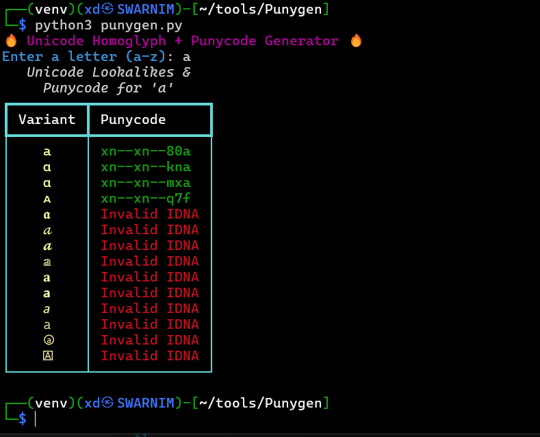

# 🔡 Unicode Homoglyph + Punycode Generator

A fun and powerful terminal-based tool that helps you find **visually similar Unicode variants (homoglyphs)** of English letters (`a–z`) and outputs their **Punycode** representations — useful for domain fuzzing, phishing simulations, or red teaming!

---

## 🚀 Features

- Input any letter (`a–z`)
- See a styled table of Unicode homoglyphs
- Automatically generate valid `Punycode` using [IDNA](https://en.wikipedia.org/wiki/Internationalized_domain_name)
- Beautiful, colorful terminal UI using the [`rich`](https://github.com/Textualize/rich) library

---

## 📦 Installation

1. **Clone the repo or download the script**:
   ```bash
   git clone https://github.com/swarnimbandekar/Punygen.git
   cd unicode-punycode-generator
   ```
2. **Install dependencies**:
   ```
   pip install -r requirements.txt
   ```

---

## 🧑‍💻 Usage

**Run the script using**:
```
python fancy_punycode.py
```
Then input any letter from a to z when prompted.

## 📷 Example



---

## 💡 Use Cases

- Domain fuzzing for phishing simulations
- Unicode security research
- Red teaming / social engineering
- Visual obfuscation of text
